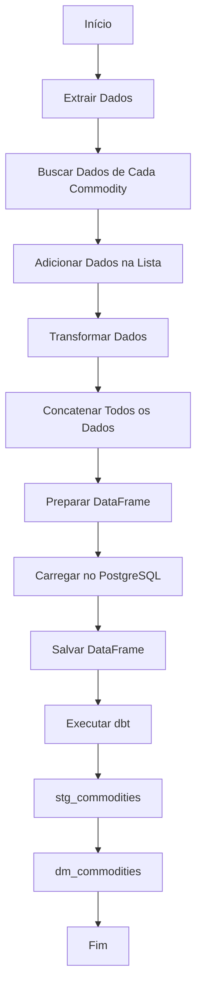

```mermaid
graph TD

A[Início] --> B[Extrair Dados]
B --> B1[Buscar Dados de Cada Commodity]
B1 --> B2[Adicionar Dados na Lista]

B2 --> C[Transformar Dados]
C --> C1[Concatenar Todos os Dados]
C1 --> C2[Preparar DataFrame]

C2 --> D[Carregar no PostgreSQL]
D --> D1[Salvar DataFrame]

D1 --> E[Executar dbt]
E --> E1[stg_commodities]
E1 --> E2[dm_commodities]
E2 --> F[Fim]
```
